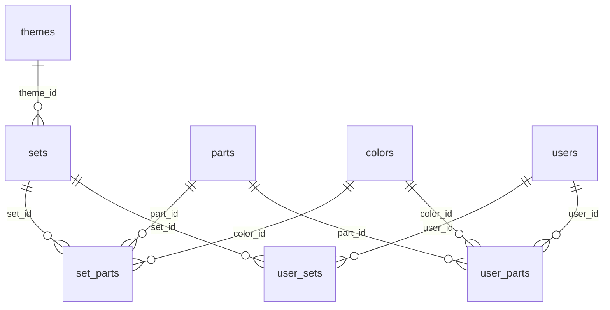

# Database Design

PostgreSQL 16, schema managed by Flyway (`apps/api/src/main/resources/db/migration`).
Hibernate runs with `ddl-auto: validate` — migrations are the single source of
truth for schema.

## Entity-Relationship Overview

## Migrations

| Version | Purpose |
| --- | --- |
| V1 | `themes`, `sets` (init schema) |
| V2 | Rebrickable metadata on `sets` (`external_theme_id`, `external_url`, `external_last_modified_at`) |
| V3 | Unique constraint on `themes.external_id` |
| V4 | `colors`, `parts`, `set_parts` (inventory) |
| V5 | `users` |
| V6 | `user_sets` |
| V7 | `user_parts` |

## Catalog Tables

### `themes`
`id` (UUID PK), `external_id` (unique), `name`, `parent_theme_id`, timestamps.

### `sets`
`id` (UUID PK), `external_set_number` (unique), `name`, `year_released`,
`theme_id` (FK to `themes`), `number_of_parts`, `image_url`, `source`,
`external_theme_id`, `external_url`, `external_last_modified_at`, timestamps.

### `colors`
`id` (UUID PK), `external_id` (unique), `name`, `rgb`, `is_transparent`,
`source`, timestamps.

### `parts`
`id` (UUID PK), `external_part_number` (unique), `name`, `external_category_id`,
`part_url`, `image_url`, `source`, timestamps.

### `set_parts`
`id` (UUID PK), `set_id`, `part_id`, `color_id` (all FK), `quantity`, `is_spare`,
`external_element_id`, `source`, timestamps.
Unique `(set_id, part_id, color_id, is_spare)`. Index on `set_id`.

## User Tables

### `users`
`id` (UUID PK), `email` (unique), `password_hash` (BCrypt), `display_name`,
`role` (default `USER`), timestamps. Index on `email`.

### `user_sets`
`id` (UUID PK), `user_id` (FK), `set_id` (FK), `status` (default `OWNED`),
`purchase_price` NUMERIC(10,2), `purchase_date`, timestamps.
Unique `(user_id, set_id)`. Index on `user_id`.

### `user_parts`
`id` (UUID PK), `user_id` (FK), `part_id` (FK), `color_id` (FK), `quantity`,
`storage_location`, timestamps.
Unique `(user_id, part_id, color_id)`. Index on `user_id`.

## Conventions

- **Primary keys:** UUID, assigned by the application.
- **Timestamps:** `created_at` / `updated_at`, non-null, DB default `CURRENT_TIMESTAMP`;
  entities set them via `@PrePersist` / `@CreationTimestamp`.
- **External data:** normalized into internal tables; `source` column tracks origin
  (default `REBRICKABLE`). Raw third-party payloads are never persisted.
- **Reference vs user data:** `parts` and `colors` are shared reference data;
  `user_*` tables are per-user and owner-scoped at the query layer.

## Not Yet Modeled (future)

Comparison, recommendation, and pricing tables (`stores`, `price_snapshots`,
`deal_alerts`, etc.) are planned but **not created**. See [roadmap](../product/roadmap.md).
