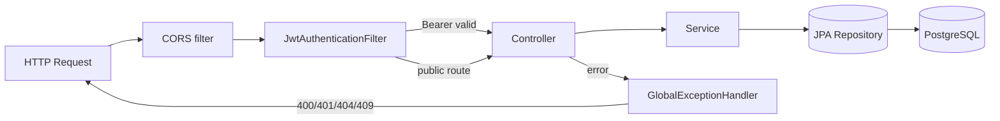
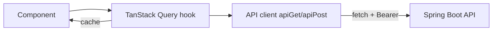

# Diagrams

Central index of the project's Mermaid diagrams. Render on GitHub or any
Mermaid-aware viewer.

## System Context
See [overview.md — System Context](./overview.md#system-context).

## Find-or-Import Sequence
See [overview.md — Data Flow](./overview.md#data-flow-find-or-import-cache-first).

## Entity-Relationship
See [database-design.md — ER Overview](./database-design.md#entity-relationship-overview).

## Request Lifecycle (auth + collection)

## Frontend Data Flow

> Keep new diagrams here or in the doc they explain, and link them from this index.
