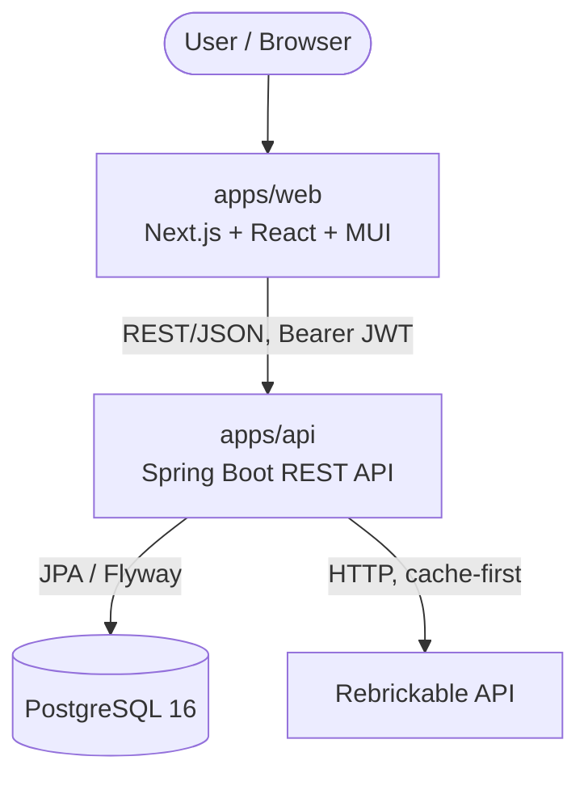
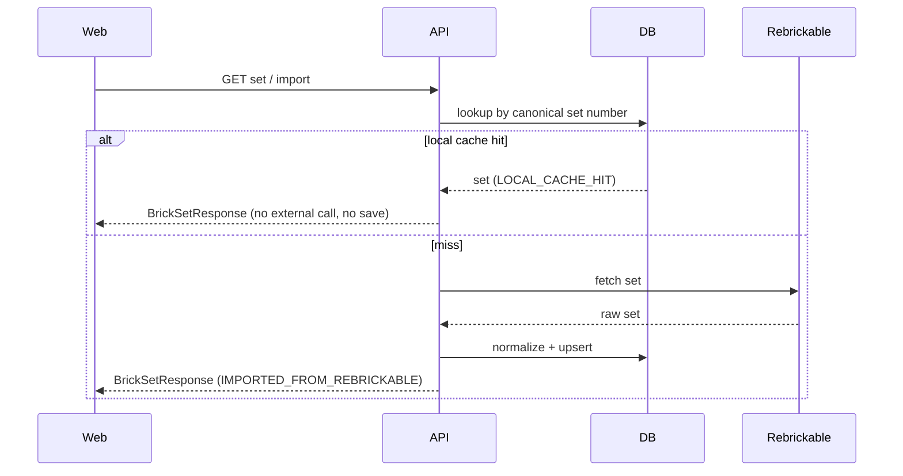

# Architecture Overview

BrickDeck is a monorepo with a Spring Boot REST API and a Next.js web app, backed
by PostgreSQL and sourcing catalog data from the Rebrickable API.

> This document describes the **current, implemented** system. Aspirational
> components (AI service, additional integrations) are called out as future scope.

## System Context



## Repository Layout (actual)

```text
brickdeck/
├── apps/
│   ├── api/                  # Spring Boot backend (Java 21, Maven)
│   └── web/                  # Next.js frontend (React 19, TS, MUI)
├── docs/                     # Documentation (this tree)
├── infra/                    # (reserved — currently empty)
├── packages/                 # (reserved — currently empty)
├── services/                 # (reserved for a future AI service — empty)
├── docker-compose.yml        # Local PostgreSQL
├── .env.example              # Environment variable template
├── CLAUDE.md                 # AI-assistant project context
└── README.md
```

> **Note:** Earlier design docs proposed `services/api`. The backend actually
> lives in `apps/api`. `services/`, `packages/`, and `infra/` are placeholders
> for future growth. See [ADR-001](../decisions/ADR-001-modular-monorepo.md).

## Backend Architecture

DDD + hexagonal: core catalog/collection logic is separate from infrastructure;
external API clients are isolated; entities are never exposed — everything maps
to DTO records. See [ADR-009](../decisions/ADR-009-hexagonal-ddd-packages.md).

Base package `com.brickdeck.api`:

```text
com.brickdeck.api
├── catalog            # sets, parts, colors, themes (controller/service/repository/entity/dto)
├── collection         # user_sets, user_parts
├── security           # JWT auth (controller, service, jwt filter, config)
├── external.rebrickable  # Rebrickable client, config, external DTOs
├── health             # health endpoint
└── common             # shared (PageResponse, exceptions, GlobalExceptionHandler)
```

## Frontend Architecture

Next.js App Router (`src/` dir) + React 19 + strict TypeScript. **MUI + Emotion**
for UI (not Tailwind/shadcn — see [ADR-007](../decisions/ADR-007-mui-frontend.md)),
TanStack Query for server state, React Hook Form + Zod for forms.

```text
apps/web/src
├── app/               # App Router routes (/sets, /sets/[setNumber])
├── features/          # feature components + hooks (sets/...)
├── lib/               # api client, query keys, types, env
└── providers/         # ThemeProvider, QueryProvider (client)
```

## Data Flow: Find-or-Import (cache-first)



## External Integrations

### Rebrickable (implemented)
Primary catalog source for sets, parts, colors, and inventories. API key via
`REBRICKABLE_API_KEY`. Client has connect/read timeouts. Data is normalized into
internal entities and cached; imported records track `source` and, for sets,
`external_last_modified_at`. See [ADR-005](../decisions/ADR-005-rebrickable-first.md).

### Future sources (not implemented)
BrickLink (marketplace prices) and Brickset (metadata) are candidates for later
phases. See [pricing-scraping-policy](../product/pricing-scraping-policy.md).

## Cross-Cutting Concerns

- **Errors:** `GlobalExceptionHandler` (`@RestControllerAdvice`) — see [api-design.md](./api-design.md).
- **CORS:** `/api/**` restricted to `CORS_ALLOWED_ORIGINS` (default `http://localhost:3000`).
- **Migrations:** Flyway (`V1..V7`), `ddl-auto: validate`. See [database-design.md](./database-design.md).
- **API contract:** springdoc OpenAPI at `/v3/api-docs`, Swagger UI at `/swagger-ui/index.html`.

## Technical Risks & Trade-offs

- **Rebrickable dependency:** single upstream source; rate limits and availability
  affect imports. Mitigated by local caching (cache-first reads).
- **JWT in localStorage (planned frontend):** XSS-readable; acceptable for MVP,
  revisit with httpOnly cookies at productization ([ADR-008](../decisions/ADR-008-jwt-stateless-auth.md)).
- **Shared reference data:** parts/colors are global; a bad import affects all
  users. Mitigated by idempotent upserts and unique constraints.
- **No CI yet:** quality gates run locally only ([ADR-003](../decisions/ADR-003-postgresql-flyway.md), TODO in testing docs).
