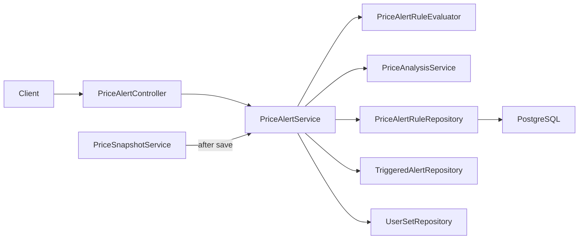

# Design: Wishlist Price Alerts — Backend Slice

Date: 2026-07-15 · Status: Approved · Phase 6 · Depends on: price-tracking slice 1 (`pricing` package), ADR-011

## 1. Summary

Lets a user set **price-alert rules** on their WISHLIST sets and get **in-app triggered alerts** when a recorded price meets a rule. Rules are evaluated **synchronously when a price snapshot is added**. No email/push, no scheduler, no external source. Extends the existing `pricing` package with alert rules, triggered alerts, an evaluator, a service, and endpoints (V9 migration).

## 2. Context

- Phase 6 slice 1 shipped `price_snapshots` (V8) + `PriceSnapshotService` (owner-scoped add/list/delete) + `PriceAnalysisService` (per-set/per-currency min/avg/max/latest + deal verdict; throws 404 when no snapshots). Both live in `com.brickdeck.api.pricing`.
- Collection has `user_sets` with a `WISHLIST` status (`UserSetRepository`, `CollectionStatus`).
- The scraping/pricing policy lists alert examples: "notify when below $2,000 MXN", "20% below average", "retired set below market average". This slice covers the first two shapes plus "at/below your lowest".
- Endpoints under `/api/v1/**` (except the public compare path) are already authenticated (`anyRequest().authenticated()`), so no `SecurityConfig` change is needed.

## 3. Goals

- Persist owner-scoped alert rules on wishlist sets (create/list/delete).
- Evaluate a user's rules for a set+currency **when a snapshot is added**, persisting a triggered alert per match.
- Support three rule types: below-target-price, percent-below-average, at-or-below-lowest.
- Expose triggered alerts (list newest-first, dismiss).
- Unit + controller + integration tests (TDD).

## 4. Non-Goals

- No email / push / any outbound notification — in-app records only.
- No scheduled re-evaluation (defer until an automated price source like BrickLink feeds prices).
- No frontend — a following slice.
- No dedup beyond per-snapshot (each snapshot evaluates each rule at most once).
- No rule editing (create + delete only); no rule on non-wishlist sets; no cross-currency logic.

## 5. Architecture

Everything lives in `com.brickdeck.api.pricing` (alerts are a pricing concern and share the snapshot/analysis machinery).



- **`PriceAlertRuleEvaluator`** (pure, stateless): decides whether a rule fires for a given amount and context. No Spring, no DB — fully unit-testable.
- **`PriceAlertService`**: rule CRUD (wishlist-guarded, owner-scoped) + `evaluateForSnapshot`.
- **`PriceSnapshotService`** gains one call to `evaluateForSnapshot` after `save`.

## 6. Data Model

Migration `V9__add_price_alerts.sql`.

### `price_alert_rules`

| Field | Type | Req | Notes |
| --- | --- | --- | --- |
| `id` | uuid | yes | PK |
| `user_id` | uuid | yes | FK → `users` |
| `set_id` | uuid | yes | FK → `sets` (the catalog table is `sets`) |
| `currency` | varchar(3) | yes | ISO 4217; a rule is currency-specific |
| `type` | varchar(30) | yes | `BELOW_TARGET_PRICE` \| `PERCENT_BELOW_AVERAGE` \| `AT_OR_BELOW_LOWEST` |
| `threshold_value` | numeric(12,2) | no | Target amount (target) or percent (percent-below-avg); null for lowest |
| `active` | boolean | yes | default true (reserved for future disable) |
| `created_at`/`updated_at` | timestamp | yes | `@PrePersist`/`@PreUpdate` |

Index: `(user_id, set_id, currency)`.

### `triggered_alerts`

| Field | Type | Req | Notes |
| --- | --- | --- | --- |
| `id` | uuid | yes | PK |
| `rule_id` | uuid | yes | FK → `price_alert_rules` (ON DELETE CASCADE) |
| `snapshot_id` | uuid | yes | FK → `price_snapshots` — the price that fired it |
| `amount` | numeric(12,2) | yes | The firing price |
| `currency` | varchar(3) | yes | Denormalized for display |
| `message` | varchar(500) | yes | Human-readable, e.g. "80.00 USD is at or below your lowest (80.00)" |
| `triggered_at` | timestamp | yes | `@PrePersist` |

Index: `(rule_id)`; reads join to `rule.user_id` for owner scoping (or denormalize `user_id` onto `triggered_alerts` for a simpler owner-scoped query — **chosen: add `user_id` to `triggered_alerts`** to avoid a join on the hot list path).

Enums stored as `varchar` via `@Enumerated(STRING)` (matches `CollectionStatus`).

## 7. Rule Evaluation (pure)

`PriceAlertRuleEvaluator.evaluate(type, thresholdValue, amount, context)` where `context = {average, lowest}` (BigDecimal):

- `BELOW_TARGET_PRICE`: fires when `amount.compareTo(thresholdValue) < 0`.
- `PERCENT_BELOW_AVERAGE`: fires when `amount <= average * (1 - thresholdValue/100)`.
- `AT_OR_BELOW_LOWEST`: fires when `amount <= lowest`.

Returns an `Optional<String>` message (present = fired). Context (`average`, `lowest`) comes from `PriceAnalysisService.analyze(userId, setNumber, currency, null)` — safe to call after the snapshot is saved (≥1 snapshot exists). The new snapshot is included in the aggregates, so `AT_OR_BELOW_LOWEST` fires on a new low or a tie, and `PERCENT_BELOW_AVERAGE` uses the post-add average.

## 8. Evaluation Flow

`PriceSnapshotService.addSnapshot(owner, request)`:
1. resolve set, build + `save` snapshot (unchanged).
2. `priceAlertService.evaluateForSnapshot(owner, savedSnapshot)` — NEW.
3. return the snapshot response (unchanged).

`evaluateForSnapshot`:
1. load active rules for `(userId, snapshot.set, snapshot.currency)`.
2. if none → return.
3. `analysis = priceAnalysisService.analyze(userId, setNumber, currency, null)` → `{averageAmount, minAmount}`.
4. for each rule, `evaluator.evaluate(...)`; on a hit, persist a `TriggeredAlert` (rule, snapshot, amount, currency, message, user).

Transaction: the whole `addSnapshot` is one `@Transactional` write; alert evaluation joins it (snapshot + any triggered alerts commit together).

## 9. API Design

**POST `/api/v1/price-alerts`** — create a rule (auth).
```json
{ "setNumber": "75257-1", "currency": "USD", "type": "BELOW_TARGET_PRICE", "thresholdValue": 100.00 }
```
`201` + `Location` + `PriceAlertRuleResponse`. `thresholdValue` required for `BELOW_TARGET_PRICE` / `PERCENT_BELOW_AVERAGE`; omitted/ignored for `AT_OR_BELOW_LOWEST`.

**GET `/api/v1/price-alerts?page=&size=`** — `PageResponse<PriceAlertRuleResponse>` (default size 20, sort `createdAt` desc).

**DELETE `/api/v1/price-alerts/{id}`** — `204`.

**GET `/api/v1/price-alerts/triggered?page=&size=`** — `PageResponse<TriggeredAlertResponse>` (newest first).

**DELETE `/api/v1/price-alerts/triggered/{id}`** — `204` (dismiss).

| Status | Reason |
| --- | --- |
| 400 | Missing/invalid input; `thresholdValue` absent for a type that needs it; not positive |
| 401 | Unauthenticated |
| 404 | Set not in the user's wishlist; rule/triggered-alert not found or not owned |

## 10. Validation Rules

- VR-001: `setNumber` required; must be a set in the user's WISHLIST → else 404.
- VR-002: `currency` matches `^[A-Z]{3}$`.
- VR-003: `type` ∈ the three enum values.
- VR-004: `thresholdValue` required and `> 0` for `BELOW_TARGET_PRICE` and `PERCENT_BELOW_AVERAGE`; for `PERCENT_BELOW_AVERAGE` also `<= 100`. Ignored for `AT_OR_BELOW_LOWEST` (stored null). Enforced in the service (cross-field), returning 400.
- VR-005: delete is owner-scoped (`findByIdAndUserId`).

## 11. Error Handling

Bean Validation → `GlobalExceptionHandler` 400. Wishlist/ownership misses → `ResourceNotFoundException` 404. Cross-field threshold rule → throw `IllegalArgumentException`-mapped 400 (add a handler if not present, else a `ResponseStatusException`); prefer a small custom validation returning the standard 400 body.

## 12. Security

All endpoints authenticated (JWT). Owner-scoped everywhere. Evaluation runs as part of the authenticated snapshot-add. No secrets, no outbound calls. `triggered_alerts.user_id` makes list/delete a single owner-scoped query with no join.

## 13. Observability / Performance

Volume tiny (a handful of rules per user). Evaluation adds one `analyze` call (already indexed) + at most N rule checks per snapshot add. Log rule create/delete + "alert triggered" at debug with ids. Paginated lists, `@EntityGraph` for the set on rule reads.

## 14. Testing Strategy

- **Evaluator (unit):** each type fires/doesn't at boundaries (target: amount just under/over; percent: exactly at `avg*(1-pct/100)`; lowest: at/below/above min). Message content.
- **Service (Mockito):** create requires wishlist (else 404); threshold required per type (else 400); owner-scoped delete; `evaluateForSnapshot` creates one alert per matching rule, none when no rules, uses analysis avg/min; skips when snapshot currency has no rules.
- **Controller (`@WebMvcTest` + `authentication()`):** POST 201+Location, 400 on bad/missing threshold, GET rules + triggered paginated (`$.content`), DELETE 204, 401 unauth (integration).
- **Integration (`@SpringBootTest`, real Postgres):** wishlist set + a `BELOW_TARGET_PRICE` rule; add a snapshot below target via `PriceSnapshotService` → a triggered alert appears in `GET triggered`; a non-firing snapshot creates none; owner isolation.

## 15. Rollout

Additive V9; no backfill. Deploy backend; frontend later. Rollback = drop the two tables (triggered cascades). Lightweight.

## 16. Alternatives Considered

| Option | Pros | Cons | Decision |
| --- | --- | --- | --- |
| Evaluate on snapshot-add (chosen) | Simple, deterministic, testable; no scheduler | Only fires on user-entered prices (fine until BrickLink) | **Chosen** |
| Scheduled scan | Fires without a new snapshot | Needs scheduling infra; premature | Deferred |
| Email delivery | Reaches user off-app | Mail infra/secrets/async | Deferred |
| `user_id` on `triggered_alerts` (chosen) | Owner-scoped list without a join | Slight denormalization | **Chosen** |
| Any-set rules | Flexible | No intent signal; broader | Wishlist-only |

## 17. Risks and Mitigations

| Risk | Impact | Mitigation |
| --- | --- | --- |
| `analyze` 404 if called with no snapshots | Med | Only called after a snapshot is saved (≥1 exists) |
| Duplicate alerts on repeated equal prices | Low | Each snapshot is a distinct event; per-snapshot single evaluation; user can dismiss |
| Cross-field threshold validation missed | Med | Service-level check + tests per type |
| Currency mismatch (rule USD, snapshot MXN) | Low | Rules loaded filtered by snapshot currency — mismatched rules simply don't load |

## 18. Open Questions

- OQ-001: Should creating a second identical rule be rejected (409) or allowed? Design: allow (no uniqueness) for slice 1.
- OQ-002: Cap percent at 100 only, or a saner max (e.g. 90)? Design: `0 < pct <= 100`.

## 19. Assumptions

- Assumption-001: Rules are wishlist-scoped and per-currency.
- Assumption-002: Evaluation on snapshot-add is sufficient until an automated price source exists.
- Assumption-003: `PriceAnalysisService.analyze` is an acceptable source of avg/min for evaluation (reused, not duplicated).

## 20. Implementation Plan (outline)

1. `V9__add_price_alerts.sql` (two tables, indexes, cascade).
2. Enums `PriceAlertType`; entities `PriceAlertRule`, `TriggeredAlert`.
3. Repositories (owner-scoped finders + active-rules-by-set-currency).
4. DTOs: `AddPriceAlertRuleRequest`, `PriceAlertRuleResponse`, `TriggeredAlertResponse`.
5. `PriceAlertRuleEvaluator` (pure) — TDD unit first.
6. `PriceAlertService` (CRUD + evaluateForSnapshot) — TDD.
7. Wire `PriceSnapshotService.addSnapshot` → `evaluateForSnapshot`; update its test.
8. `PriceAlertController` — `@WebMvcTest` TDD.
9. Integration test (real Postgres).
10. openapi.yaml + Postman; update project-state / roadmap.
