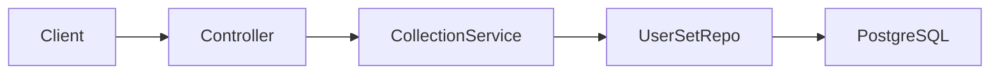
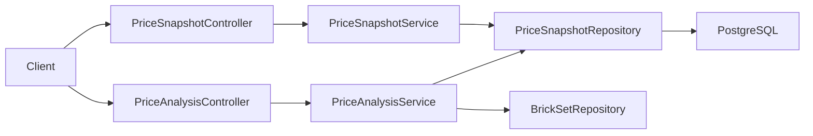

# Technical Design Document: Price Tracking — Slice 1 (Manual Snapshots + Deal Detection)

Date: 2026-07-15 · Status: Proposed · Phase 6 · Depends on: ADR-011

## 1. Summary

First backend slice of Phase 6. Lets an authenticated user **record observed set prices** (manual snapshots) and get a **price analysis / deal verdict** for a set computed from their own snapshot history plus price-per-piece. No external price API — this is the ADR-011 "user-submitted snapshots first" track. A new `pricing` domain package and a `price_snapshots` table (V8) are added; a later slice plugs BrickLink into the same model.

Affected: new `pricing` package (`entity`, `repository`, `dto`, `service`, `controller`), one Flyway migration, `openapi.yaml` + Postman.

## 2. Context

- Catalog sets are cached locally (`brick_sets`, has `numberOfParts`; **no RRP/MSRP field**). Collection features (`user_sets`, `user_parts`) are authenticated and **owner-scoped** via `findByIdAndUserId`, returning `PageResponse<T>`; entities use Lombok `@Getter/@Setter` + `@PrePersist` timestamps.
- No pricing exists anywhere yet. Rebrickable provides no prices (ADR-005).
- Policy (`pricing-scraping-policy.md`) + ADR-011: start with user-submitted snapshots; deal quality from current price vs history / lowest / MSRP / price-per-piece.

## 3. Goals

- Persist user-submitted price snapshots in a **source-agnostic** table (so BrickLink reuses it).
- CRUD-lite: add, list (by set), delete — authenticated, owner-scoped.
- Compute a per-set **price analysis** (count / min / avg / max / latest / price-per-piece) over the user's snapshots in one currency.
- Evaluate a **candidate price** against that history → a deal verdict.
- Unit + controller + integration tests (TDD); openapi + Postman updated.

## 4. Non-Goals

- No external price fetch (BrickLink/BrickOwl) — later slice.
- No alerts/notifications (email/push) — later slice.
- No automatic MSRP/RRP import — `BrickSet` has no RRP; deferred.
- No community/shared price pool — snapshots are per-user in this slice.
- No currency conversion — analysis is per-currency; mixed currencies are not combined.
- No frontend — a following slice.

## 5. Requirements Reference

- Spike: `docs/superpowers/specs/2026-07-15-phase6-price-data-sources-spike.md`
- Decision: `docs/decisions/ADR-011-price-data-sourcing.md`
- Roadmap Phase 6 success criterion: *"User can see whether a current price is actually a good deal."*
- No FDD exists for Phase 6. TODO: optional FDD later.

## 6. Current Architecture



Collection endpoints: authenticated, owner-scoped, `PageResponse`. No pricing tables.

## 7. Proposed Architecture



New `pricing` package (hexagonal, mirrors `collection`). `PriceAnalysisService` reads snapshots + the set (for `numberOfParts`) and is a **pure** aggregation/deal calculator (unit-testable without a DB).

## 8. Component Design

### 8.1 Controller Layer
- `PriceSnapshotController` (`/api/v1/price-snapshots`): POST add (201 + Location), GET list (paginated, filter by `setNumber`), DELETE by id (204). `@AuthenticationPrincipal User`.
- `PriceAnalysisController` (`/api/v1/sets/{setNumber}/price-analysis`): GET analysis for the current user, optional `candidatePrice` + required `currency`.

### 8.2 Service Layer
- `PriceSnapshotService`: resolve target set (find-or-import via `BrickSetService.findOrImportEntity`, as `CollectionService` does), validate, persist; list/delete owner-scoped (`findByIdAndUserId`).
- `PriceAnalysisService`: load the user's snapshots for the set + currency, compute aggregates and (if `candidatePrice` given) a deal verdict. Pure logic given inputs.

### 8.3 Repository Layer
- `PriceSnapshotRepository extends JpaRepository<PriceSnapshot, UUID>`:
  - `Page<PriceSnapshot> findByUserId(UUID, Pageable)` (`@EntityGraph brickSet`)
  - `Page<PriceSnapshot> findByUserIdAndBrickSet_ExternalSetNumber(UUID, String, Pageable)`
  - `List<PriceSnapshot> findByUserIdAndBrickSet_ExternalSetNumberAndCurrency(UUID, String, String)`
  - `Optional<PriceSnapshot> findByIdAndUserId(UUID, UUID)`

### 8.4 External Integration Layer
Not in this slice. The `source` column reserves space for `external.bricklink` (ADR-011 slice 2) writing the same table.

## 9. Data Model

| Table | Purpose |
| --- | --- |
| `price_snapshots` | One observed price for a set, submitted by a user. Source-agnostic. |

| Field | Type | Required | Notes |
| --- | --- | --- | --- |
| `id` | uuid | yes | PK |
| `user_id` | uuid | yes | FK → `users`. Owner (submitter). |
| `set_id` | uuid | yes | FK → `brick_sets`. |
| `source` | varchar(30) | yes | `MANUAL` now; later `BRICKLINK`, etc. |
| `condition` | varchar(10) | yes | `NEW` \| `USED`. |
| `currency` | char(3) | yes | ISO 4217 (e.g. `USD`, `MXN`). |
| `amount` | numeric(12,2) | yes | `> 0` (DB CHECK + Bean Validation). |
| `store` | varchar(255) | no | Free text (e.g. "LEGO Store", "Mercado Libre"). |
| `url` | varchar(1024) | no | Listing link. |
| `observed_at` | date | yes | When the price was seen; not in the future. |
| `created_at` | timestamp | yes | `@PrePersist`. |
| `updated_at` | timestamp | yes | `@PrePersist`/`@PreUpdate`. |

- Index: `(user_id, set_id)`; secondary `(user_id, set_id, currency)` for analysis reads.
- **No uniqueness** — multiple observations over time are expected.
- Migration: `V8__add_price_snapshots.sql`. Additive; no backfill.
- Enums (`PriceSource`, `PriceCondition`) stored as `varchar` via `@Enumerated(STRING)` (matches `CollectionStatus`).

## 10. API Design

**POST `/api/v1/price-snapshots`** — add a snapshot (auth).
```json
{ "setNumber": "75257-1", "amount": 129.99, "currency": "USD",
  "condition": "NEW", "observedAt": "2026-07-14", "store": "LEGO Store", "url": null }
```
Response `201` + `Location`:
```json
{ "id": "…", "setNumber": "75257-1", "amount": 129.99, "currency": "USD",
  "condition": "NEW", "source": "MANUAL", "observedAt": "2026-07-14",
  "store": "LEGO Store", "url": null, "createdAt": "…" }
```

**GET `/api/v1/price-snapshots?setNumber=&page=&size=`** — `PageResponse<PriceSnapshotResponse>` (default `size=20`, `sort=observedAt,desc`).

**DELETE `/api/v1/price-snapshots/{id}`** — `204`.

**GET `/api/v1/sets/{setNumber}/price-analysis?currency=USD&candidatePrice=119.99`** — `PriceAnalysisResponse`:
```json
{ "setNumber": "75257-1", "currency": "USD", "snapshotCount": 5,
  "minAmount": 119.99, "averageAmount": 134.50, "maxAmount": 159.99,
  "latestAmount": 129.99, "numberOfParts": 1351, "pricePerPiece": 0.089,
  "candidate": { "amount": 119.99, "pricePerPiece": 0.089,
    "percentBelowAverage": 10.8, "atOrBelowLowest": true, "verdict": "GREAT_DEAL" } }
```
`candidate` is null when `candidatePrice` is omitted.

| Status | Reason |
| --- | --- |
| 400 | Invalid input (amount ≤ 0, bad currency/condition, future date, missing `currency`) |
| 401 | Unauthenticated |
| 404 | Set not found/importable, or no snapshots for that set+currency |

## 11. Validation Rules

- VR-001: `amount` > 0 (`@Positive`) + DB CHECK.
- VR-002: `currency` matches `^[A-Z]{3}$` (`@Pattern`).
- VR-003: `condition` ∈ {`NEW`,`USED`} (enum bind).
- VR-004: `observedAt` required, not in the future (`@PastOrPresent`).
- VR-005: `setNumber` required; must resolve to a local/importable set else 404.
- VR-006: `store` ≤ 255, `url` ≤ 1024.
- VR-007: analysis `currency` required (avoid mixing currencies); `candidatePrice` > 0 if present.

## 12. Error Handling

| Error Type | Handling Strategy | Response |
| --- | --- | --- |
| Validation | Bean Validation → `GlobalExceptionHandler` | 400 `{validationErrors}` |
| Set missing/not importable | `ResourceNotFoundException` | 404 `{message}` |
| No snapshots for set+currency | `ResourceNotFoundException` | 404 `{message}` |
| Snapshot not owned / missing on DELETE | `findByIdAndUserId` empty → `ResourceNotFoundException` (no existence leak) | 404 |
| Unexpected | Existing handler | 500 |

## 13. Security Considerations

- All endpoints authenticated (JWT, ADR-008); `anyRequest().authenticated()` already covers `/api/v1/price-snapshots` and `/api/v1/sets/**` except the public compare path — **no `SecurityConfig` change needed**.
- Owner-scoped reads/deletes via `findByIdAndUserId` — a user only sees/deletes their own snapshots.
- `url` is stored/echoed as data, never fetched server-side in this slice (no SSRF surface).
- No secrets; no external API keys in this slice.
- Logging: do not log full user snapshot rows at info; amounts are low-sensitivity but keep logs lean.

## 14. Observability

- Reuse existing request logging. Lightweight: log snapshot create/delete at debug with `setNumber` + `userId` (no PII beyond the id). No new metrics tooling; a future counter for snapshots-per-day is a nice-to-have (`TODO`).

## 15. Performance and Scalability

- Volume tiny (personal price logs). Analysis loads one user's snapshots for one set+currency — bounded; `(user_id, set_id, currency)` index makes it an index range scan.
- Aggregation done in-service over a small list (could move to a JPQL `min/avg/max` later if lists grow); slice-1 keeps it in Java for testability.
- List endpoint paginated (`PageResponse`, default 20). No N+1: `@EntityGraph brickSet`.

## 16. Transaction and Consistency Strategy

- Create/delete are single-row, `@Transactional`. Analysis is `@Transactional(readOnly = true)`.
- No idempotency/uniqueness — repeated snapshots are valid data points.
- Find-or-import of the target set reuses the cache-first path (no double fetch).

## 17. Testing Strategy

### Unit (Mockito)
- `PriceAnalysisService`: min/avg/max/latest correct; price-per-piece = amount/`numberOfParts` (null parts → null PPP); verdict thresholds (`GREAT_DEAL` at ≤ min, `GOOD_DEAL` ≤ avg·(1−0.10), `FAIR`, `POOR` above avg); candidate null when not provided; empty history → 404.
- `PriceSnapshotService`: resolves/import set; persists with `source=MANUAL`; delete owner-scoped (cross-user → 404).
- Validation of request record (constraint annotations) — via controller slice.

### Controller (`@WebMvcTest` + `authentication()`)
- POST 201 + Location + body; 400 on amount ≤ 0 / bad currency / future date; 404 when set unresolved.
- GET list paginated (`$.content`, `$.page`); DELETE 204; DELETE others' id → 404.
- Analysis 200 with/without `candidatePrice`; 400 missing `currency`; 404 no snapshots.

### Integration (`@SpringBootTest` + real Postgres)
- Seed user + set (`numberOfParts`) + several snapshots (mixed currencies + conditions) → analysis for `USD` ignores `MXN` rows; min/avg/PPP correct; candidate verdict; owner isolation (another user sees none).

### Contract
- Add endpoints + `PriceSnapshotResponse`/`PriceAnalysisResponse` schemas to `openapi.yaml`; add a `Pricing` folder to the Postman collection. Assert `$.content[0]`, never `$[0]`.

### Edge cases
- Empty history, single snapshot (min=avg=max), null `numberOfParts`, candidate exactly at avg / at min, mixed-currency isolation, future `observedAt` rejected.

## 18. Rollout Plan

- Additive migration V8; no backfill, no breaking change. Deploy backend, then (later slice) frontend. Rollback = drop table (no dependents). Lightweight for a solo project.

## 19. Alternatives Considered

| Option | Pros | Cons | Decision |
| --- | --- | --- | --- |
| Per-user snapshots (chosen) | Matches collection idiom; no moderation/trust surface; simple | Thin history → weaker "average" until BrickLink | **Chosen** for slice 1 |
| Community/shared price pool | Richer averages | Trust/moderation/spam; bigger scope | Deferred |
| Aggregate in SQL (min/avg/max JPQL) | Less data shipped | Harder to unit-test; premature at this volume | Deferred; revisit if lists grow |
| Store MSRP on `brick_sets` now | Enables below-RRP signal | No RRP source wired (needs Brickset); scope creep | Deferred (spike Finding 4) |
| Reuse `/collection/*` namespace | Fewer top-level paths | Snapshots aren't "collection" items | Use `/price-snapshots` + `/sets/{n}/price-analysis` |

## 20. Risks and Mitigations

| Risk | Impact | Mitigation |
| --- | --- | --- |
| Sparse personal history makes "deal" weak | Medium | Verdict also uses price-per-piece + candidate-vs-latest; BrickLink market avg lands next slice |
| Mixed currencies skew averages | High if unhandled | Analysis requires a `currency` param; snapshots filtered by it |
| Verdict thresholds arbitrary | Low | Keep them named constants; tune later; documented |
| Schema churn when BrickLink lands | Low | `source`/`currency`/`condition` discriminators designed in now (ADR-011) |

## 21. Open Questions

- OQ-001: Deal verdict thresholds — is 10% below average the "good deal" cutoff, or configurable?
- OQ-002: Launch currencies — restrict to a known set (USD, MXN) or accept any ISO 4217?
- OQ-003: Should analysis fall back to *all currencies* when the user has none in the requested currency, or strictly 404? (Design: strict 404.)

## 22. Assumptions

- Assumption-001: Snapshots are per-user in slice 1 (community pool deferred).
- Assumption-002: `numberOfParts` is present for most sets; null → `pricePerPiece` omitted.
- Assumption-003: One currency per analysis request; no conversion.
- Assumption-004: Target set is resolved via existing find-or-import (like `CollectionService`).

## 23. Implementation Plan

1. `V8__add_price_snapshots.sql` (table + indexes + CHECK).
2. `PriceSource`, `PriceCondition` enums; `PriceSnapshot` entity (`@PrePersist`).
3. `PriceSnapshotRepository` (owner-scoped finders + `@EntityGraph`).
4. DTO records: `AddPriceSnapshotRequest`, `PriceSnapshotResponse`, `PriceAnalysisResponse` (+ nested `CandidateEvaluation`).
5. `PriceAnalysisService` (pure) — TDD unit first.
6. `PriceSnapshotService` (add/list/delete) — TDD.
7. `PriceSnapshotController` + `PriceAnalysisController` — `@WebMvcTest` TDD.
8. Integration test (real Postgres).
9. `openapi.yaml` + Postman (`Pricing`).
10. Update `.claude/project-state.md`, `roadmap.md`; ADR-011 already merged.
